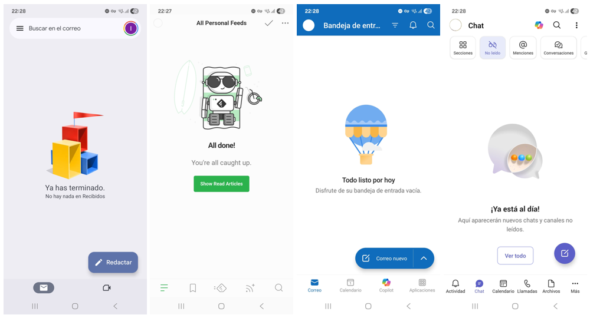

# Bandeja vacía + backlog = paz mental

Si eres de esas personas que (1) marcan miles de mails como leídos en la bandeja de entrada, sin sentir estrés y sin olvidar nada importante; (2) resisten a la tentación de contestar al último mail o chat, sólo por ser el último; (3) tienen claridad absoluta respecto a _una_ prioridad en todo momento; y (4) son capaces de centrar su trabajo en dicha prioridad, este artículo no es para ti.

Si eres del montón restante, como yo, quizá te sirva.

Una de las ideas en mi experiencia buenas —y que no se han quedado obsoletas— del viejo método GTD (Getting Things Done - David Allen, 2001) es **analizar** brevemente **todo** lo que te llega. Y conseguir así una maravillosa bandeja de entrada vacía que te dará paz mental. Todas las semanas, en algún momento, consigo lo de la imagen. ¿No te parece una belleza? 😍

_Bandejas vacías de GMail, Feedly, Outlook y Teams, respectivamente. El último, más concretamente, es el filtro de no leídos._

Las palabras que puse arriba en negrita son importantes.

- La palabra **"todo"** es importante para entender el para qué. Si no conoces cuál es el trabajo sobre el que elegir por dónde empezar, ¿cómo vas a priorizar? Claro que tendrás en la cabeza —o mejor, en algún backlog— la prioridad actual entre tus "épicas". Pero ¿y si recibes un mensaje que supone ejecutar un paso clave nuevo para tu prioridad nº1, o que te invita a pivotar en algún aspecto de la misma? En menor medida, también podrías recibir un mensaje que pida a gritos modificar el rumbo, llevándote a cambiar tu actual prioridad por otra diferente (aquí, cuidado: quien mucho abarca poco aprieta, y mejor tener una prioridad que tres). Ojo: tampoco necesitas conocer el 100% del trabajo posible, porque entonces estarías mirando la bandeja de entrada cada segundo que pasa, y eso no es eficiente por los cambios de contexto. En mi caso, la consigo todas las semanas, en algún momento. Antaño lo hacía diariamente, pero me afectaba a la conciliación porque en días de mucho input no me es posible ni siquiera leer todo lo que entra. Cada uno que busque su cadencia.
  - Resumen: _La única manera de saber que estás trabajando en lo que debes, es un porcentaje alto de consciencia sobre todo lo que hay sobre la mesa._

- La palabra **"analizar"** es importanbte para hacerlo bien. Aquí hay dos trampas que superar:
  - La contrapartida de la búsqueda de la "bandeja vacia" es que tú no controlas cuánto ni cuándo te escribirán terceros. Y tu día a día debes liderarlo tú y tus prioridades, no lo que los demás te envíen.
    - Para controlar el _cuándo_: acota el tiempo que dedicas a analizar lo que llega, controlando el "cuándo". No tienes por 
          - Recomendación adicional (stronger for GenZ/GenAlpha 😅): quita el sonido de las notificaciones, quita los banners que saltan en el escritorio. y reduce éstas sólo a lo que realmente aporte algo que merezca la pena. Si tu vida es un tsunami de infoxicación digital, no podrás hacer más que "_analizar_". Y es mucho más gratificante construir, no todo va a ser dopamina en la vida.

    - Para controlar el _cuánto_: Aquí está el reto. Y dependerá mucho del contexto de cada uno.
      - primera, para hacerlo bien: se trata de **analizar**. _Exclusivamente_. Es entender lo que te ha llegado. No es contestarlo, ni diseñar la solución, ni cabrearte porque es una estupidez supina, ni dejarte llevar por ese "y lo necesito para mañana, aunque ni te he preguntado cuánto crees que podrías tardar". Será imposible que tu mente no te lleve hacia esos derroteros, pero tienes que resistir la tentación. Ya sabes que está ahí.
        - Una de las cosas de GTD que te recomiendo es aquello de "si dura menos de dos de menos minutos, hazlo ya". ¿Cuántas veces has acertado y realmente ha supuesto menos de dos minutos? ¿Cuántas "pequeñas tareas" (o distracciones) tienes a lo largo de la semana y cuánto tiempo suman al final? ¿Cuánto valor aportan; eran imprescindibles?

      - Recomendación adicional (stronger for GenZ/GenAlpha 😅): date de baja de esa cantidad infinita de contenido basura. Si tu vida es un tsunami de infoxicación digital, no podrás hacer más que "_analizar_". Construir es también gratificante; no todo va a ser dopamina en la vida 😋.

___
xx ene  2026
