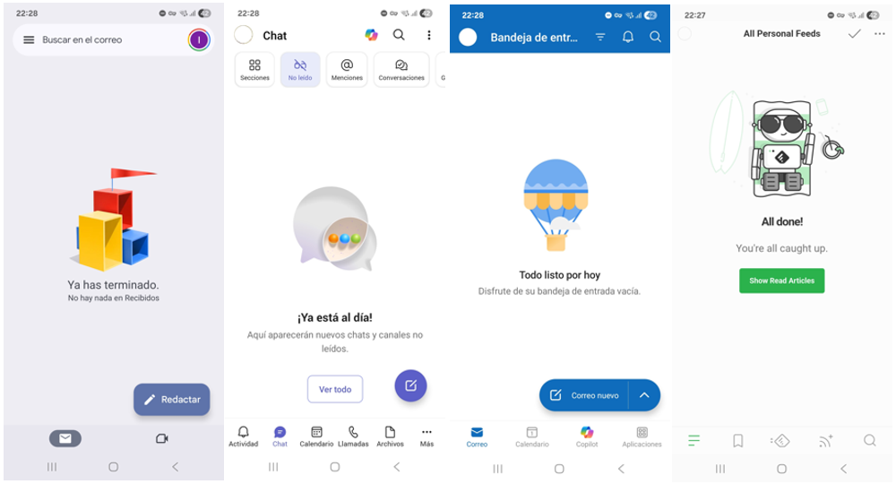

# PRUEBAS DE FORMATO

https://amnexiii.github.io/non_published_material/aaa_pruebas_formato.html

https://amnexiii.github.io/bandeja_vacía.html

## Expand

Sección 1

**Al menos una vez por semana, lee _en diagonal_ todos los mensajes que hayas recibido. _En diagonal_ significa "la lectura mínima necesaria para evaluar su prioridad". Añade tu backlog priorizado sólo la información útil que proceda. Una vez vaciadas las bandejas, continúa trabajando en _la_ entrada más prioritaria.**

Sección 2

  

Esto es HTML puro.

<strong>Negrita HTML</strong>

Y aquí Markdown normal:
- Lista
- Enlaces
- **Negrita**

`código`

  Incluso <em>divs</em>, imágenes, etc.

Sección 3: prueba real

  

| **Al menos una vez por semana, lee _en diagonal_ todos los mensajes que hayas recibido. _En diagonal_ significa "la lectura mínima necesaria para evaluar su prioridad". Añade tu backlog priorizado sólo la información útil que proceda. Una vez vaciadas las bandejas, continúa trabajando en _la_ entrada más prioritaria.**

- La palabra **todos** es importante para entender el para qué. Si no conoces cuál es el trabajo sobre el que elegir por dónde empezar, ¿cómo vas a priorizar? Me puedes contraargumentar que ya tienes tu actual "épica" más prioritaria en la cabeza —y en algún backlog, para no olvidarla durante las vacaciones 😊— y que, por tanto, no necesitas leer todo para seguir con lo prioritario. Tiene cierto sentido. Pero ¿qué pasa si recibes un mensaje que te revela el nuevo paso más prioritario dentro de dicha épica? ¿Qué pasa si supone cambiar la manera en que estás ejecutando tu prioridad? En menor medida, ¿qué pasa si un mensaje pide a gritos modificar el rumbo, llevándote a sustituir tu actual prioridad por otra?  Por otro lado, ¿qué ocurre si te piden ayuda para la prioridad nº1 de otra persona o área, y eres consciente de que esa es más importante que la tuya? Te toca ser generoso y ponerla por encima de la tuya...

  - **Resumen: _La única manera de saber que estás trabajando en lo que debes, es ser consciente de lo que hay sobre la mesa._**
  
- La palabra **lee** es importante para que la propuesta no sea contraproducente. Aquí hay dos trampas que superar: cuánto y cuándo.

  - **Cúanto: controlar el nivel de profundidad de la lectura.** Usé conscientemente la palabra _leer_ en lugar de _analizar_. Piensa que el objetivo es sólo priorizar. Normalmente, es suficiente con leer _en diagonal_. No necesitas conocer en profundidad lo que te ha llegado, sino al mínimo nivel necesario que permita contestar esta pregunta: ¿es esto y _ahora_ parte mi prioridad nº1, o es algo que la desplaza? Piensa sólo eso. No contestes al mensaje. No diseñes una solución en tu cabeza para lo que plantea el mensaje, aunque sepas hacerlo. No te cabrees si el mensaje es una estupidez supina. No te dejes llevar por ese "lo necesito para mañana" que ha soltado alguien que no conoce la complejidad de lo solicitado, y a quien lele importa sólo su agenda, no la tuya. Tu mente te llevará hacia esos derroteros; el juego es resistir la tentación.

  - **Cuándo: controlar el momento de leer.** Necesitas conocer _lo que hay sobre la mesa_ a menudo, pero no el 100% del tiempo. Eso supondría consultar la bandeja de entrada cada segundo que pasa, porque no puedes controlar cuándo te escribirán terceras personas. No tendría sentido: los cambios de contexto fragmentarían tu tiempo de concentración dedicados a lo prioritario, "romperían tu flow". La solución es acotar los momentos adecuados para leer. En mi caso, siempre leo después de comer, que no me rompe ningún foco profundo; y mi objetivo de bandeja vacía es "todos los viernes". Bloqueo huecos en mi calendario para fomentarlo. Antaño vaciaba las bandejas diariamente, pero eso afectaba a mi conciliación, porque en días de mucho input era  imposible ni siquiera leer todo lo que entraba sin alargar el final de la jornada. Cada cual debe buscar su cadencia.

  - **Resumen: _Tu día a día y tu prioridad la controlas tú, no terceros. Busca momentos para leer en diagonal lo que entra._**

- La palabra **backlog** es la que permite priorizar con bandeja vacía. Una vez entendida la prioridad, anota la información clave o el título del mail en la entrada del backlog correspondiente. Te recomiendo dos niveles de backlog. El más abstracto debe contener todos los grandes temas o "épicas", simplificando la priorización, y en cada épica anota la información más de detalle, incluida esa que recibes de fuera, representando el segundo nivel. Puede que te preguntes por qué hacer esto es lugar de, simplemente, "marcar como leídos" los mails y dejarlos ahí para más adelante. La diferencia es clave: **en un backlog puedes ordenar los elementos por prioridad**. En tu bandeja de mail, no. Si acumulas en tu mail cientos de elementos, ¿cómo seleccionas el siguiente más importante? Además, no sólo tienes mail, sino esas decenas o cientos de chats... Con un backlog que eventualmente priorices, las entradas de arriba del todo son la prioridad. Coge la primera; ahora es el momento de leer los mensajes asociados con el nivel de profundidad analítica que requieren.

  - **Resumen: _Apunta lo que suponga trabajo en un backlog priorizado. Trabaja en lo de arriba, no en el último mail que llegó._**

 
  

## Vídeo

cambiar https://www.youtube.com/watch?v=fehg0zjXMmI por https://www.youtube.com/embed/fehg0zjXMmI

<iframe width="560" height="315" src="https://www.youtube.com/embed/fehg0zjXMmI" frameborder="0" allowfullscreen></iframe>

## Texto

—

~~texto tachado~~

`código` o uso como `tag1` `tag2`

<mark>resaltado</mark>

## Imágenes

✔ Ancho: 1000 px → ideal para la mayoría de artículos

✔ Peso: < 300 KB

✔ Responsive: max-width:100%

Imagen sólo con ![]

Imagen con HTML max-width:100%

## Tabla

Mes | Actividad | Productividad real (entrega de resultados)
-|-|-
Enero | Superar la gripe navideña.   Contar qué tal en las vacas.   Pensar qué hacer este año. | 0%
Febrero | x | x
Marzo | |
Abril| |
Mayo | |

## Mermaid

Según https://akuszyk.com/2023-05-03-yet-another-mermaid-in-github-pages-guide.html?utm_source=chatgpt.com

[Importar java]

Pintar gráfico 1:
<pre class="mermaid">
flowchart LR
     A-->B
</pre>

Pintar gráfico 2:
<pre class="mermaid">
graph LR
    %% Evento de Inicio
    Start(( )) --- OpenGate{ }

    subgraph Pool_Desayuno [Proceso de Desayuno Imperativo]
        direction LR
        
        %% Compuerta paralela (AND)
        OpenGate{ } --> Lane_A[<b>Persona A:</b> Preparar Bebida]
        OpenGate{ } --> Lane_B[<b>Persona B:</b> Preparar Comida]

        %% Carril Persona A
        subgraph Lane_A
            direction LR
            A1[Poner cafetera] --> A2[Calentar leche]
            A2 --> A3[Mezclar café y leche]
        end

        %% Carril Persona B
        subgraph Lane_B
            direction LR
            B1[Tostar pan] --> B2[Sacar ingredientes]
            B2 --> B3[Untar mantequilla y mermelada]
        end

        %% Sincronización (AND Join)
        A3 --> CloseGate{ }
        B3 --> CloseGate{ }

        %% Tarea final y fin
        CloseGate{ } --> FinalTask[Colocar en mesa]
        FinalTask --> End(( ))
    end

    %% Estilos BPMN
    style Start fill:#dfd,stroke:#3c3,stroke-width:2px
    style End fill:#fdd,stroke:#c33,stroke-width:4px
    style OpenGate fill:#ff9,stroke:#990,stroke-width:2px
    style CloseGate fill:#ff9,stroke:#990,stroke-width:2px
</pre>

 

